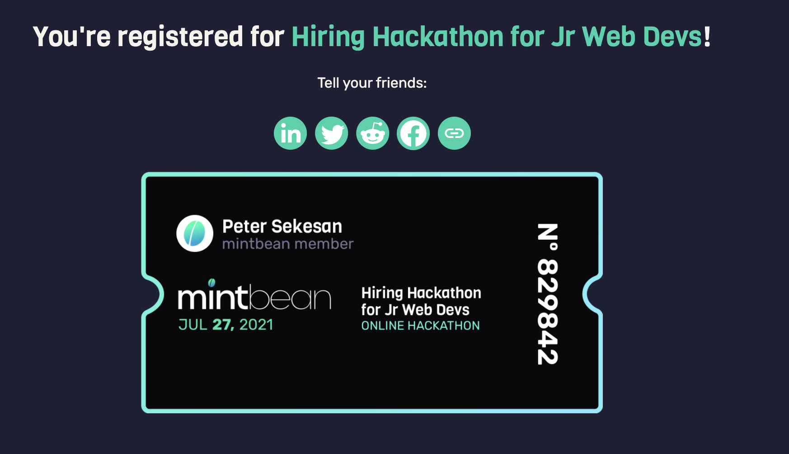

# Welp, Here Goes Nothing!

So, not quite sure I know what I have gotten myself into but here we are. I've officially registered for my first hackathon which started yesterday, July 27th and runs through August 3rd.

I registered for [MintBeans Hiring Hackathon for Jr Web Devs](https://mintbean.io/meets/7e2331fb-1e0d-4b31-86b9-a46acad877af/resources). It is a three part challenge allowing junior devs such as myself to showcase out skills and maybe get some attentions from hiring managers.

You must complete one of the following challenges:

- **Frontend**: Build a single-player in-browser card game.
   
- **Backend**: Build an API that lets authenticated players play a card game over HTTP.
   
- **Full-Stack**: Combine the above and build a multiplayer in-browser card game.

I am not sure what I am going to decide on, but I am leaning towards the Full-Stack challenge. I feel like it could be the best way to really show what I have come to learn. I'm thinking I may even team up with some of my fellow boot-camp grads to really put together something nice.

I will be updating here daily during it with any thoughts, discoveries and observations as a first time hackathon participant. Take care and see you guys tomorrow!
