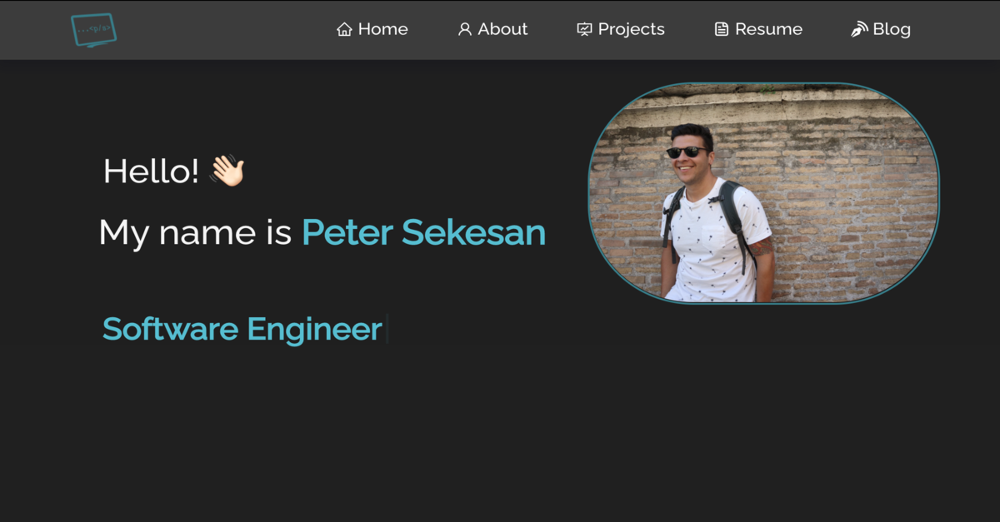

So I know what you most likely are thinking:
"Pete, why are you using React for a simple static developer portfolio?"

I know. I get it. When I was in my boot camp, one of our first tasks was to build a dev portfolio. Later on when I was in the React portion of the curriculum, I thought to myself that I would love to redo it in React at some point. I reached out to the web and some mentors and I got conflicting advice.a1

"Sure, it could be a good way to show your skills with React"
or
"There is no need to use React which is for a dynamically changing application on a static site"

I eventually sided with the latter. It really was overkill to do it. I was never quite able to shake the thought of it however.

The thing is, I genuinely enjoy programming in React. I think it is honestly my strongest skill at the moment just because I like to constantly work in it.
I finally decided to just go for it. Whatever, I know an employer would most likely look at my projects to see my skills and not how I coded my portfolio, but it was due for an update and again, I just enjoy it.

This time however, I used it as an excuse to learn something new and built it out using a bunch of new libraries. Most notably, [react-bootstrap](https://react-bootstrap.github.io/). I had only been taught previously coding with pure CSS. While understanding these fundamentals was valuable, in the real world, it is just not feasible to write it all out from scratch when you have these invaluable libraries at your disposal. After using it, and being able to wrap my content in pre-defined <code>Columns, Rows & Containers</code>, it made the process that much easier to get a nice layout going.

Overall, I had a blast working on it. I would love to hear any feedback or critiques of it as well. Check it out here:
<a href="https://peter-sekesan.dev">

