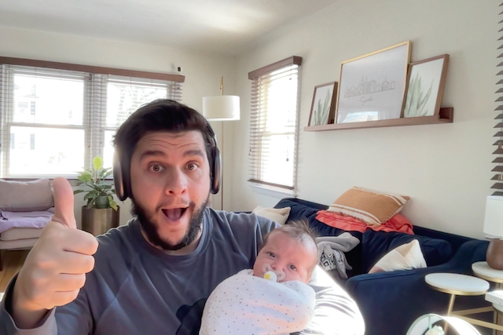

# "A little life update"

Hey everyone! It’s been some time since I’ve last uploaded this blog, but I figure it’s time to give an update and a good kickstart to updating this more frequently. So if I peruse back to my last post, it was way back in August of 2021. I had just participated in a junior developer hackathon. Life seemed to be getting back to normal and Omicron was a word no one knew about.

I won’t bore you with every detail from the time in-between then and now, but a few noteworthy ones come to mind.

1. I happily accepted and offer and started working in November of 2021 as a Frontend UX Developer for Adelphi University.
2. I welcomed my second daughter into the world in January of 2022.
    
    
   
   _The new Intern_

 

I’ve truly been enjoying my time working with my new team. Everyone has been super helpful and accommodating getting me up to speed. It’s been the perfect way to start a new career path. I am actually in the process of testing on our development sever my first custom built component for the site and I cannot wait for it to go live to show you.

Life with two children 3 and under has been what you expect it to be. Gone for now are my late nights up coding and working on side projects and continuing my learning. Sleep is at an absolute premium right now so I take it when I can get it. Hopefully once she starts sleeping through the night in a few weeks I can get back into that groove.

I will update again shortly more about my journey on working on my first component, but I just wanted to get the ball rolling again with this update.
